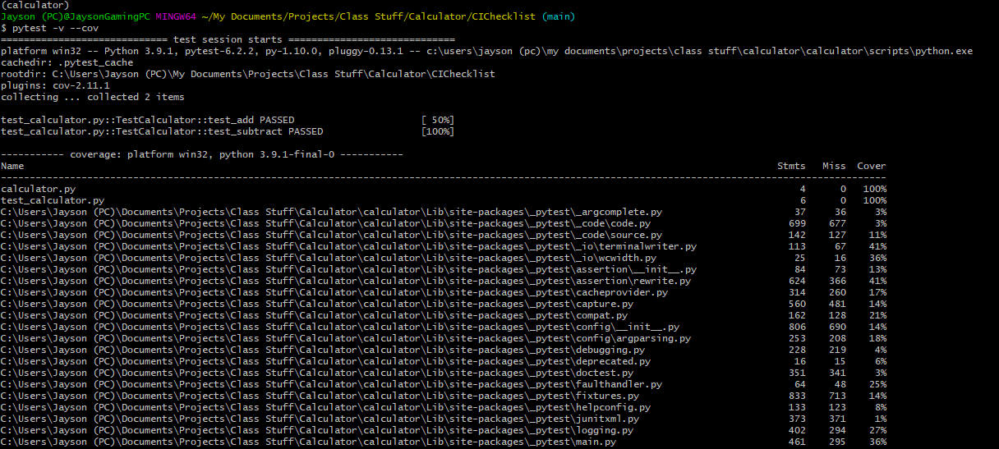
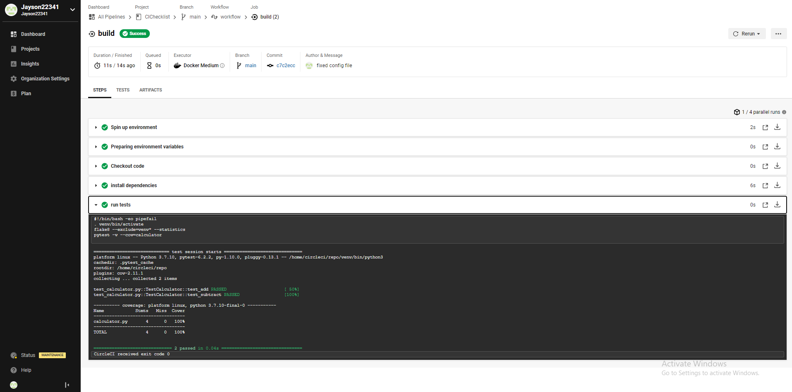

# CIChecklist
for in-class-activity CS 362

Here's the photo of my first pytest run that was successful: 

**(NOTE: I initially made the virtual environment inside of the repository, and I think that's why there's all of the other python tests inside of the pytest, but the main 2 files, calculator.py and test_calculator.py, were tested and were successful)**

Here's the photo from circleCI of the build running successfully:

